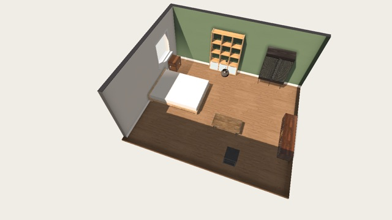
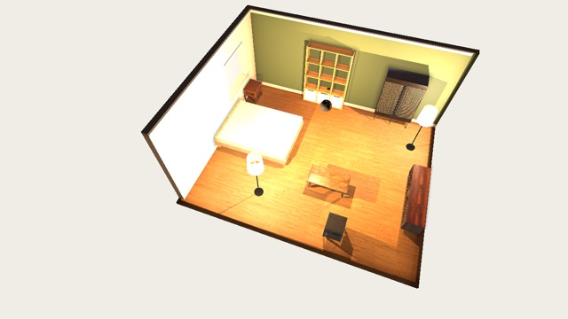
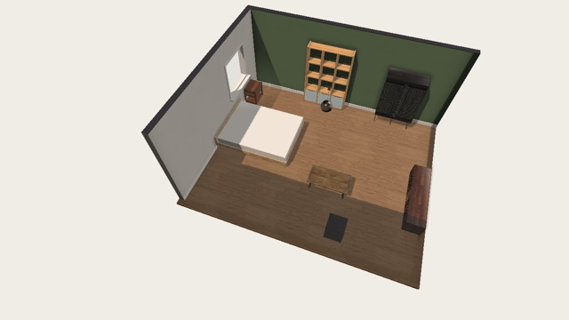
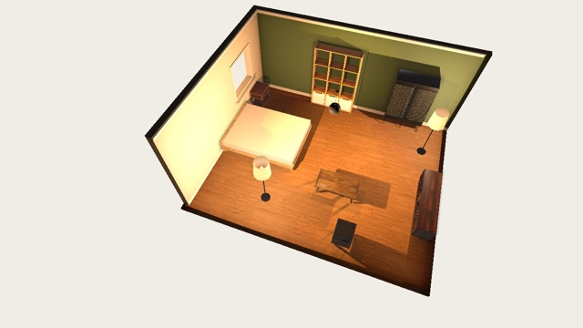
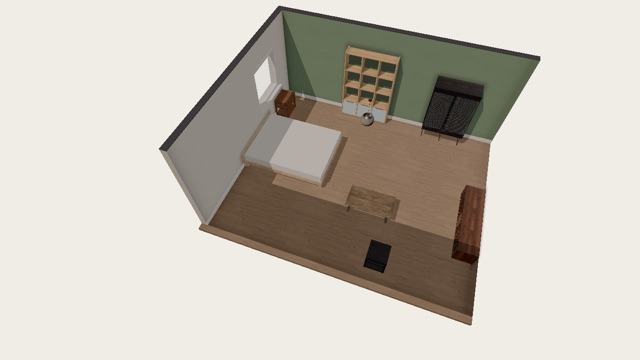
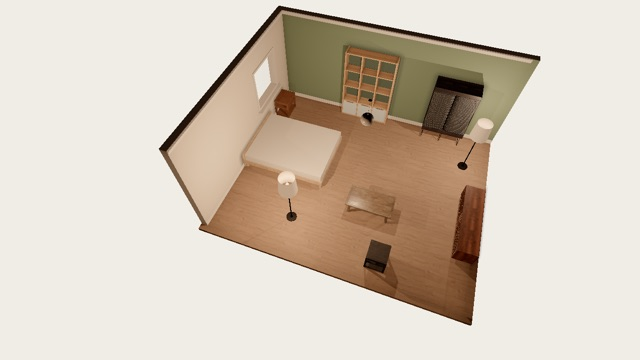

# Web stack benchmark: Godot vs three.js

Which stack should the room planner ship on the web? The same simulator
exists twice in this repo:

| | Godot build (`game/`) | three.js build (`three/`) |
|---|---|---|
| Renderer | Godot 4.7.1 **Compatibility** (WebGL 2); the only Godot renderer that runs on the web | three.js r186 `WebGLRenderer` (WebGL 2); `?renderer=webgpu` optional |
| Physics | Box3D (GDExtension, wasm) | Box3D (same sources, own wasm shim), or Rapier with `?physics=rapier` |
| Content | `game/assets`, `game/data/catalog.json` | the same files, loaded from `game/`, not copied |
| Contract | postMessage `ready` / `layout` / `catalog` / `bench` | identical |

Both are live on Pages: Godot at `/`, three.js at `/three/`, and the
benchmark page at `/bench/`.

**Recommendation: three.js + Box3D, with instancing as the next step.** The
choice is a trade-off, not a sweep:
- **Load:** three.js is ready 2–9× sooner and downloads 61% less, on every
  device. Every shopper pays this.
- **Runtime:** after the Godot shadow work (below), Godot is faster on both
  Android phones in every scene, and on the iPhone 16 with 150 pieces.
  three.js is faster on the iPhone 12 in every scene, and on the iPhone 16
  in the scenes with several shadowed lights.
- **Why three.js loses with many objects:** it is CPU-bound in JavaScript,
  about 2–13 ms per frame in `renderer.render()` against 0.2–1.7 ms in Godot
  (desktop). Instancing repeated furniture addresses exactly that.

For a planner embedded in a store page, where every visit pays the load and
few rooms hold 150 pieces, the load time decides it.

## How it is measured

- **The bench page** (`tests/web/bench/page`, served at `/bench/`) loads each
  build in a same-origin `<iframe>`, as the Shopify store does, and drives it
  only through the postMessage contract both builds speak. Neither stack gets
  a private fast path.
- **Frame times** are sampled with `requestAnimationFrame` inside the sim's
  frame, timed at callback time. After a long task, rAF timestamps bunch up
  and read as impossibly fast frames.
- **"slow %"** is the share of frames longer than 1.5× the display's refresh
  interval, taken from the idle room and floored at 240 Hz. Phones cannot turn
  vsync off, so fps alone saturates at 60 or 120.
- **Settling:** before each scenario the page waits until the sim reports the
  layout's pieces, then lets it settle. The three.js build rebuilds its world
  asynchronously when the room size changes; a fixed wait could sample the
  old room.
- **Quality** is pinned to `?quality=high`, so the low-spec watchdog cannot
  switch tiers mid-run.
- **Runs:** two or three per device, interleaved with a rotating order; the
  median is reported.

| scenario | what it is |
|---|---|
| empty | default 6 × 5 m room, nothing placed |
| showroom | 7 pieces and a window, sun shadows (`three/tests/fixtures/showroom.json`) |
| night | ceiling on, ceiling light and 2 floor lamps; the sun and 3 positional lights all shadowed |
| drop-150 | 150 pieces dropped at once in a 12 × 12 m room, sampled while they settle |
| crowd-150 | the same 150 pieces once asleep |
| walk | first person through the showroom, walking into the coffee table |

## Real devices (BrowserStack, 2026-09-29)

Commit `cda4e1a`, before the Godot optimisations below. Two runs, 4 s samples
(the iPhone 12 row is a single run with 1.5 s samples: its full run was lost to the
session queue).

### Load

| device | Godot ready | three.js ready | Godot MB | three.js MB |
|---|---:|---:|---:|---:|
| Samsung Galaxy M32 (Android 11, Mali-G57) | 17.8 s | **1.9 s** | 17.5 | **6.8** |
| Google Pixel 7 (Android 13) | 9.8 s | **5.4 s** | 17.5 | **6.8** |
| iPhone 12 (iOS 17) | 14.0 s | **6.4 s** | 17.5 | **6.8** |
| iPhone 16 (iOS 18) | 11.0 s | **3.6 s** | 17.5 | **6.8** |
| MacBook, macOS Tahoe, Safari 26 | 9.3 s | **2.7 s** | 17.5 | **6.8** |

"Ready" is from navigation to the sim's `ready` message, over the network
from GitHub Pages (gzip). The Godot engine alone is a 44 MB wasm
(`index.side.wasm`, uncompressed), because GDExtension support needs the
dynamic-linking engine build.

### Frame rate (fps, Godot / three.js)

| scene | M32 | Pixel 7 | iPhone 12 | iPhone 16 |
|---|---|---|---|---|
| showroom | 54 / **57** | 89 / 90 | 36 / **52** | 54 / **60** |
| night | **32** / 26 | **54** / 46 | 42 / **45** | 33 / **55** |
| walk | **43** / 40 | 64 / **71** | 20 / **44** | 26 / **55** |
| drop-150 | **13** / 10 | **32** / 23 | 25 / **34** | **39** / 35 |
| crowd-150 | **12** / 11 | **32** / 22 | 19 / **21** | **40** / 32 |

- **iPhone:** three.js holds about 55 fps at night and in the walk, where
  Godot drops to 20–33.
- **Android, realistic rooms:** close to a tie. Frame times on the Pixel 7
  are steadier with three.js (showroom p95 13 ms against 21 ms).
- **150 pieces:** Godot leads on Android and on the iPhone 16. That's CPU:
  Godot spends 0.2–1.7 ms submitting a frame, three.js 2–13 ms in
  `renderer.render()` (desktop figures, below). Every piece is its own draw
  call, and three.js pays JavaScript overhead on each. Instancing repeated
  furniture is the fix on the three.js side.
- **Physics** is not a factor: Box3D costs 0.02–0.2 ms per step in both.

Not counted:
- **Windows 11 / Chrome:** BrowserStack's VM renders with "Microsoft Basic
  Render Driver" (no GPU), 1–13 fps for both builds.
- **macOS Safari:** both builds sit at the 60 fps cap in every scene, so only
  the load times say anything.

### After the Godot optimisations (2026-09-30)

Live build `85ba7d1` (the optimisations below, and the WebKit fix). Two runs
per phone, 3 s samples.

The Pixel 7 and iPhone 12 needed a second attempt. The first time, the Pixel 7's Chrome
renderer died during Godot's drop-150. The iPhone 12 stalled on the second
Godot load in the same page: iOS Safari had not freed the first Godot iframe's
wasm memory. `browserstack.mjs` now loads a fresh page per run and gives up on
a device that makes no progress for 6 minutes; with that, both completed.

**Godot, before → after (fps):**

| scene | Galaxy M32 | Pixel 7 | iPhone 12 | iPhone 16 |
|---|---|---|---|---|
| showroom | 54 → **59** | 89 → 90 | 36 → 39 | 54 → **59** |
| night | 32 → **40** (+27%) | 54 → **81** (+50%) | 42 → 36 | 33 → **38** (+16%) |
| walk | 43 → **46** | 64 → **78** (+23%) | 20 → 22 | 26 → **48** (+88%) |
| drop-150 | 13 → **20** (+59%) | 32 → **39** | 25 → 23 | 39 → **41** |
| crowd-150 | 12 → **24** (2×) | 32 → **42** | 19 → 20 | 40 → **44** |

(The iPhone 12's "before" is a single run with 1.5 s samples, so its small
drops are within noise: Godot did not gain there.)

**Godot / three.js, after:**

| | Galaxy M32 | Pixel 7 | iPhone 12 | iPhone 16 |
|---|---|---|---|---|
| ready | 17.9 s / **3.6 s** | 10.4 s / **2.4 s** | 13.4 s / **2.9 s** | 8.2 s / **1.4 s** |
| showroom | 59 / 58 | 90 / 90 | 39 / **46** | 59 / 60 |
| night | **40** / 33 | **81** / 64 | 36 / 38 | 38 / **49** |
| walk | **46** / 41 | **78** / 60 | 22 / **45** | 48 / **60** |
| drop-150 | **20** / 10 | **39** / 26 | 23 / **30** | **41** / 35 |
| crowd-150 | **24** / 10 | **42** / 26 | 20 / **28** | **44** / 30 |

After the shadow work, Godot is faster at runtime than three.js on both
Android phones in every scene, and on the iPhone 16 with many pieces.
three.js is faster in every scene on the iPhone 12, and in the scenes with
several shadowed lights on the iPhone 16. It loads 4–6× faster on all four
phones. Load times vary run to run with the network (three.js on the M32:
1.9 → 3.6 s).

## Godot optimisations (commit `33ec513`)

Godot's web renderer draws every shadowed light as another pass over
everything it reaches. The Godot build was paying more for shadows than the
three.js build:

| change | why | desktop effect |
|---|---|---|
| Sun shadow: 4-split cascade → one orthogonal map | the room fits in one map; three.js renders one | walk **+32%**, 150 pieces **+20%**, night +3% |
| Positional shadows 2048 → 1024 px | matches three.js | no change on desktop (fill-rate bound phones should gain) |
| One shadowed lamp on touch devices (was 2) | each is a cube map and a lighting pass | mirrored in three.js |
| Walk: skip the unused contact-plane report | an Array of Dictionaries per move | CPU only |

A shorter lamp range (5 → 3.5 m) was tried and dropped: no gain, and a changed
look. Each change is a `Lighting.PERF` default with a `?perf=key:value`
override for A/B runs.

Local A/B, headed Chrome 154 on an Apple-silicon Mac, uncapped (fps):

| Godot variant | showroom | night | walk | drop-150 | crowd-150 |
|---|---:|---:|---:|---:|---:|
| before | 472 | 282 | 241 | 87 | 92 |
| `sun:ortho` | 473 | 292 | **318** | **105** | **108** |
| `omni:1024` | 470 | 273 | 241 | 86 | 90 |
| `lamp_range:3.5` (dropped) | 442 | 278 | 237 | 86 | 87 |
| all three | 428 | **316** | **314** | **108** | **111** |
| three.js | 318 | 174 | 230 | 76 | 76 |

The look is unchanged by these (ΔE2000 4.38 / 10.32 / 13.79 against
4.37 / 10.33 / 13.80).

## Box3D and WebAssembly

**The engine upgrade.** Stink-O/box3d-godot `main`, which carries Erin
Catto's broad-phase rewrite and SAT optimisations, sped up the heavy case in
the browser:

| physics ms/step, 150 pieces dropping | old core | new core |
|---|---:|---:|
| Godot build | 0.125 | 0.119 |
| three.js build | 0.164 | 0.139 |

Every other scenario is unchanged within timer resolution. Chrome coarsens
`performance.now()` to 100 µs without cross-origin isolation.

**SIMD.** Both builds compile Box3D with WebAssembly SIMD. Without it, a
heavy settle is 1.7× slower (0.32 → 0.54 ms per step, three.js shim, same
results). SIMD also sets the browser floor at **Safari / iOS 16.4**, Chrome 91
and Firefox 89. On a real iPhone 13 on iOS 15.4 both builds used to hang
without a word; both loaders now say the browser is too old.

## Looking alike

A benchmark between two builds that look different is not comparing like
with like. `tests/web/bench/compare-look.mjs` renders the same scenes in both
(`?ui=0`, same layout and camera) and compares them block by block in CIELAB
(ΔE2000: under 2 is invisible side by side, under 5 reads as the same
colour).

| scene | before | after |
|---|---:|---:|
| day | 10.3 | **4.4** |
| night | 17.4 | 10.3 |
| walk | 19.8 | 13.8 |

Two fixes made that possible:
- **A three.js bug:** walls hidden by the cutaway were not casting shadows.
  three.js tests object layers against the viewing camera in the shadow pass.
- **Godot lighting gains** (`Lighting.GAINS`), searched by
  `tests/web/bench/calibrate.mjs`.

Night stays apart because Godot's Compatibility renderer lights in sRGB
space: each light's pool reaches the screen unencoded, so lamps and the
ceiling light come out several times stronger than in a linear pipeline. No
brightness gain can make both match. The ceiling light was dimmed to about
5% so switching it on changes the room as much as in three.js.

| | day | night |
|---|---|---|
| Godot, before |  |  |
| Godot, after |  |  |
| three.js |  |  |

## Rerunning it

```sh
cd tests/web && npm ci
bench/export-godot.sh                      # Godot working tree -> web/ (Godot 4.7.1, emsdk 4.0.11)
(cd ../../three && bun run box3d && bun run build)
node bench/bench.mjs                       # local, headed Chrome, uncapped
node bench/bench.mjs --targets "godot=../,godot-x=../?perf=sun:pssm4,three"   # A/B
node bench/browserstack.mjs --devices m32,pixel7,iphone12,iphone16   # real devices, against Pages
node bench/compare-look.mjs                # do the two builds look alike?
```

`browserstack.mjs` reads `tests/web/.env.browserstack` (gitignored):
`BROWSERSTACK_USERNAME=` and `BROWSERSTACK_ACCESS_KEY=`. Raw results go to
`bench-results/` (gitignored); this page is the curated record.
